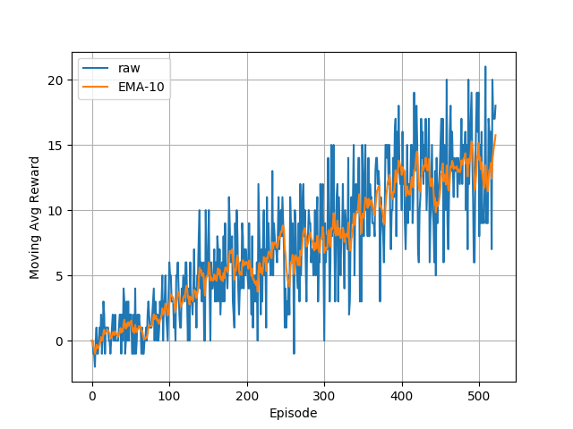

# Project 1: Value-Based Learning for Navigation (and bananas!)

The following details my solution to training a reinforcement learning agent to navigate the banana environment using Deep Q Learning.

## Learning Algorithm
This solution employs the Deep Q learning algorithm, which employs a neural network to estimate the action-values for a given state in the environment. In particular, the Double DQN modification was used, which utilizes a 'target network' to estimate the action-values, while allowing the higher-variance 'local network' to still choose the highest-value action to take.

### Hyperparameters
Note: While there may be more hyperparameters than those listed below, these parameters are those that are of the utmost interest and effect on learning.

*Epsilon-greediness*: epsilon: 1->0.005, iteratively multiplied by 0.995 each episode

*Moving average rewards*: last 100 rewards tracked for performance measurement

*Memory replay buffer*: 100,000 experience tuples

*Memory replay batch size*: 64 experience tuples

*Discount factor*: 0.99

*Network weights soft update ratio*: 0.001 of local network weights used in target network

*Network learning rate*: 5e-4

*Episodes per learning update*: 4

### Neural Network Architecture(s)
```bash
QNetwork(
  (conv1): Conv1d(1, 32, kernel_size=(3,), stride=(1,))
  (pool1): MaxPool1d(kernel_size=3, stride=2, padding=1, dilation=1, ceil_mode=False)
  (bn1): BatchNorm1d(32, eps=1e-05, momentum=0.1, affine=True, track_running_stats=True)
  (conv2): Conv1d(32, 16, kernel_size=(3,), stride=(1,), padding=(1,))
  (pool2): MaxPool1d(kernel_size=3, stride=2, padding=1, dilation=1, ceil_mode=False)
  (bn2): BatchNorm1d(16, eps=1e-05, momentum=0.1, affine=True, track_running_stats=True)
  (fc1): Linear(in_features=144, out_features=64, bias=True)
  (fc2): Linear(in_features=64, out_features=4, bias=True)
)
```

## Results


## Future Work
- Use various priority-defined sampling distributions over the memory replay buffer. A simple one is presented in the paper, but there is a lot of other potential for estimating the importance of experience tuples.
- Explore other mechanisms by which a 'target network' or 'teacher network' can lead and constrain the higher-variance local network.
