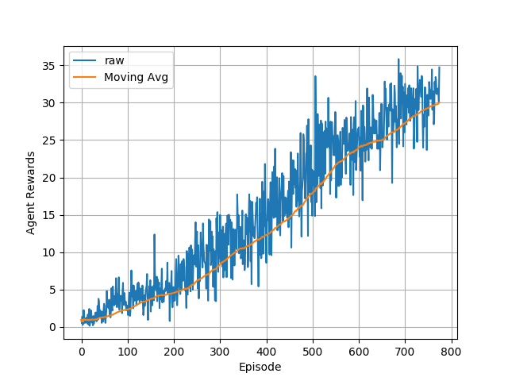

# Project 2: Policy-Based Learning for Continuous Control

The following details my solution to training a reinforcement learning agent to perform continuous control using a policy-network-based actor-critic method (DDPG).

## Learning Algorithm
This solution uses the DDPG algorithm, which employs two neural networks (an actor and a critic) to learn to take optimal actions in the environment.
One main characterization of a reinforcement learning algorithm is whether it is value-based or policy-based. Value-based methods estimate only action-values (i.e. the Q function), whereas policy-based methods estimate only optimal actions (i.e. the policy function). Both of these approaches each have their pros and cons, so it does not make sense to simply choose one over the other for a given situation. DDPG follows this insight, and combines both approaches into learning. The
algorithm is one of a general class of algorithms known as "actor-crtic" algorithms.
The (policy-based) actor network focuses on "learning through doing" and continually learns to estimate the _maximizer_ of the action values over the next state (similar to Q learning). This kind of learning is typically associated with higher error due to variance.
The (value-based) critic network focuses on "learning through careful projection and review" and continually learns to estimate the optimal action-value (Q) function itself, as opposed to only the maximizer. Because of the stronger assumptions imposed, this kind of learning is typically associated with higher error due to bias.
In this framework, the bias of the critic is used to reduce the error due to variance of the actor.
This is done by the critic acting as the _baseline of the actor_.
By combining the benefits of both value-based and policy-based learning, actor-critic methods enjoy the following advantages:
- learning is *faster* then policy-based methods
- learning finds *more consistent* methods than policy-based methods
- learning finds *better* methods than value-based methods

### Hyperparameters
Note: While there may be more hyperparameters than those listed below, these parameters are those that are of the utmost interest and effect on learning.

*Epsilon-greediness*: epsilon: 1->0.005, iteratively subtracted by 1e-6 each episode

*Memory replay buffer*: 1,000000 experience tuples

*Memory replay batch size*: 256 experience tuples

*Discount factor*: 0.99

*Network weights soft update ratio*: 0.001 of local network weights used in target network

*Network learning rate*: 1e-3

*Episodes per learning update*: 20

*Experience tuples re-visited per learning update*: 10

*Ornstein-Uhlenbeck sigma*: 0.2

*Ornstein-Uhlenbeck theta*: 0.15

### Neural Network Architecture(s)

#### Actor Network
Actor(
  (fc1): Linear(in_features=33, out_features=400, bias=True)
  (bn1): BatchNorm1d(400, eps=1e-05, momentum=0.1, affine=True, track_running_stats=True)
  (fc2): Linear(in_features=400, out_features=300, bias=True)
  (fc3): Linear(in_features=300, out_features=4, bias=True)
)

#### Critic Network
Critic(
  (fcs1): Linear(in_features=33, out_features=400, bias=True)
  (bn1): BatchNorm1d(400, eps=1e-05, momentum=0.1, affine=True, track_running_stats=True)
  (fc2): Linear(in_features=404, out_features=300, bias=True)
  (fc3): Linear(in_features=300, out_features=1, bias=True)
)

## Results

## Future Work
- Employ NAS methods to find improved neural network architectures
- Parallelize training
- Use various priority-defined sampling distributions over the memory replay buffer. A simple one is presented in the paper, but there is a lot of other potential for estimating the importance of experience tuples.
- Explore other mechanisms by which a 'target network' or 'teacher network' can lead and constrain the higher-variance local network.
