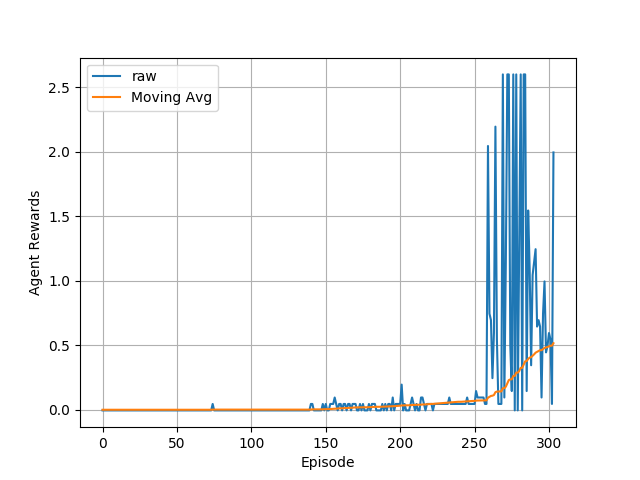

# Project 3: Multi-Agent Learning for Collaboration and Competition

The following details my solution to training a reinforcement learning agent to perform multi-agent learning using a multiple policy-network-baseds (DDPG).

## Learning Algorithm
This solution employs the DDPG algorithm, which employs a neural network to estimate the optimal action to take for a given state in the environment.
Unlike Deep Q learning, policy-based methods make no attempt to directly estimate the action-value of particular states; while it can be said that such valuation exists latently within the network, the output of the network is simply the action to take.

### Hyperparameters
Note: While there may be more hyperparameters than those listed below, these parameters are those that are of the utmost interest and effect on learning.

*Epsilon-greediness*: epsilon: 1->0.005, iteratively multiplied by 0.995 each episode

*Moving average rewards*: last 100 rewards tracked for performance measurement

*Memory replay buffer*: 1,000,000 experience tuples

*Memory replay batch size*: 512 experience tuples

*Discount factor*: 0.99

*Network weights soft update ratio*: 0.01 of local network weights used in target network

*Network learning rate*: 1e-3

*Episodes per learning update*: 1

*Experience tuples re-visited per learning update*: 1

*Ornstein-Uhlenbeck sigma*: 0.2

*Ornstein-Uhlenbeck theta*: 0.15

### Neural Network Architecture(s)
The actor and critic networks are identical for both agents in the game.

#### Actor Network
```bash
Actor(
  (fc1): Linear(in_features=24, out_features=400, bias=True)
  (bn1): BatchNorm1d(400, eps=1e-05, momentum=0.1, affine=True, track_running_stats=True)
  (fc2): Linear(in_features=400, out_features=300, bias=True)
  (fc3): Linear(in_features=300, out_features=2, bias=True)
)
```

#### Critic Network
```bash
Critic(
  (fcs1): Linear(in_features=24, out_features=400, bias=True)
  (bn1): BatchNorm1d(400, eps=1e-05, momentum=0.1, affine=True, track_running_stats=True)
  (fc2): Linear(in_features=402, out_features=300, bias=True)
  (fc3): Linear(in_features=300, out_features=1, bias=True)
)
```

## Results


## Future Work
- Employ NAS methods to find improved neural network architectures
- Parallelize training
- Use various priority-defined sampling distributions over the memory replay buffer. A simple one is presented in the paper, but there is a lot of other potential for estimating the importance of experience tuples.
- Explore other mechanisms by which a 'target network' or 'teacher network' can lead and constrain the higher-variance local network.
